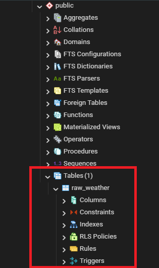
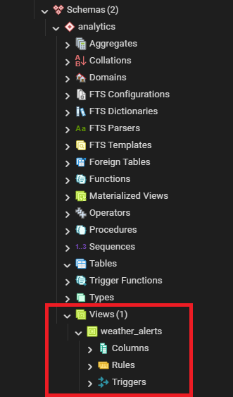
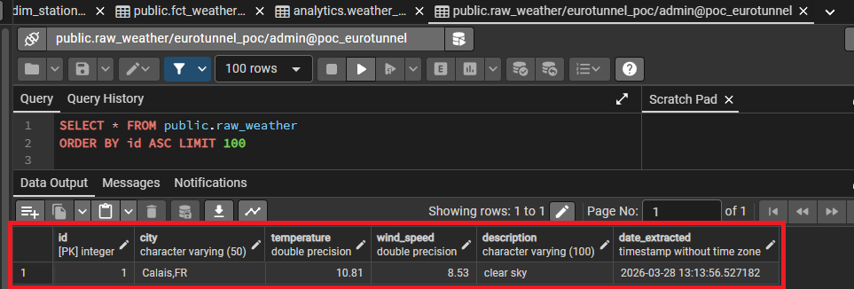
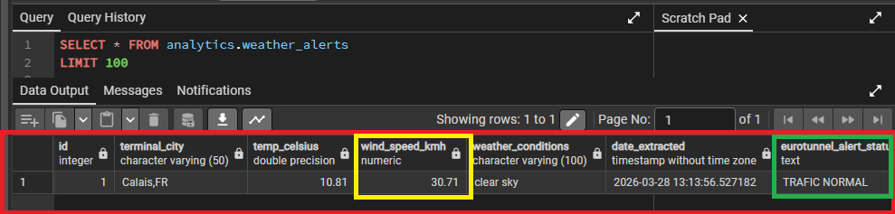

# Eurotunnel weather & traffic pipeline (mini-POC)

## Objectif du projet

Ce projet est un mini Proof of Concept en Data Engineering.  
L’objectif est de croiser les conditions météo dans le détroit du Pas-de-Calais avec les impacts possibles sur le trafic d’Eurotunnel (Getlink).

Concrètement, lorsqu’il y a des vents forts ou une tempête, les ferries (DFDS, P&O) peuvent être bloqués au port. Une partie du trafic est alors redirigée vers le tunnel sous la Manche, ce qui peut entraîner des pics d’affluence importants.

Ce projet propose une première approche pour anticiper ces situations en :
- récupérant des données météo
- les stockant proprement
- les transformant
- générant un statut d’alerte simple

---

## Résultat du pipeline

Le projet couvre tout le cycle de la donnée : ingestion, stockage, transformation et exposition.

### Structure de la base

La base est organisée en deux parties :
- `raw` : données brutes
- `analytics` : données transformées et prêtes à être utilisées

- Image 1 : création de la table `raw_weather` après l’extraction Python  

  

- Image 2 : génération de la vue `weather_alerts` via dbt dans le schéma `analytics`



---

### Transformation des données

- Image 3 : données brutes issues de l’API OpenWeatherMap  
  (température, vent en m/s, description, date)

  

- Image 4 : données transformées avec dbt  
  - conversion du vent en km/h  
  - génération d’un statut métier (`TRAFIC NORMAL` dans cet exemple)



---

## Stack technique

- Extraction : Python (`requests`) via l’API OpenWeatherMap  
- Base de données : PostgreSQL  
- Infrastructure : Docker & Docker Compose  
- Transformation : dbt  
- Sécurité : variables d’environnement (`.env`)

---

## Prérequis

- Docker et Docker Compose  
- Python 3.8+  
- Une clé API OpenWeatherMap

---

## Installation et exécution

### 1. Cloner le projet

```bash
git clone https://github.com/Jeremy-Huleux/_mini_poc_eurotunnel.git
cd poc-eurotunnel-data
```

---

### 2. Configuration (.env)

1. Créer un compte sur OpenWeatherMap  
2. Récupérer une clé API  
3. Copier le fichier d’exemple :

```bash
cp .env.example .env   # Linux / Mac
copy .env.example .env # Windows
```

4. Ajouter la clé API dans le fichier `.env` :

```env
OPENWEATHER_API_KEY=...
```

---

### 3. Lancer la base de données

```bash
docker compose up -d
```

---

### 4. Préparer l’environnement Python

```bash
python -m venv venv

# Windows
venv\Scripts\activate

# Mac / Linux
source venv/bin/activate

pip install -r requirements.txt
```

---

### 5. Lancer l’ingestion

```bash
python extract.py
```

Les données sont insérées dans la table `raw_weather`.

---

### 6. Lancer la transformation

```bash
cd transform_eurotunnel
dbt run
```

Les données transformées sont disponibles dans le schéma `analytics`.

---

## Pistes d’amélioration

Ce projet est volontairement simple. Plusieurs évolutions sont possibles :

- Automatisation du pipeline avec un orchestrateur (Airflow, Prefect)  
- Déploiement sur un environnement cloud (AWS, GCP, Azure)  
- Ajout de données métier (trafic réel Eurotunnel)  
- Mise en place d’un outil de visualisation (Power BI, Metabase)  
- Ajout de tests de qualité de données avec dbt  
- Intégration d’une CI/CD (GitHub Actions)

---

## Remarque

Ce projet a pour objectif de montrer :
- une structuration claire des données  
- une séparation entre données brutes et données transformées  
- une première approche orientée métier  

Il s’agit d’une base qui peut être étendue vers une architecture data plus complète.

## Paternité & Licence
Ce projet a été pensé et développé de A à Z par **Jérémy Huleux** pour servir de Proof of Concept (Portfolio) dans le cadre de ma recherche de stage en Data Engineering.

Le code est mis à disposition sous **licence MIT**. L'objectif n'est pas de proposer un produit commercialisé, mais de démontrer concrètement mes compétences techniques (Python, dbt, Docker). Vous êtes totalement libres de vous en inspirer, de le tester ou de le réutiliser au sein de vos équipes, tant que la paternité initiale (le nom de l'auteur) est conservée.
